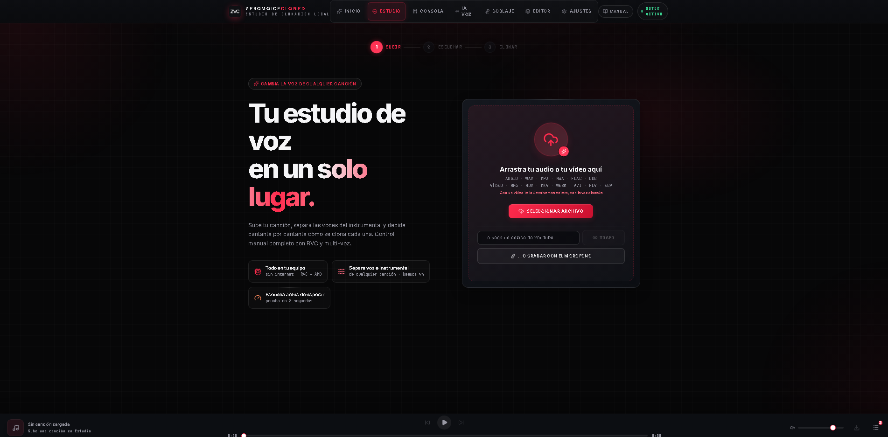
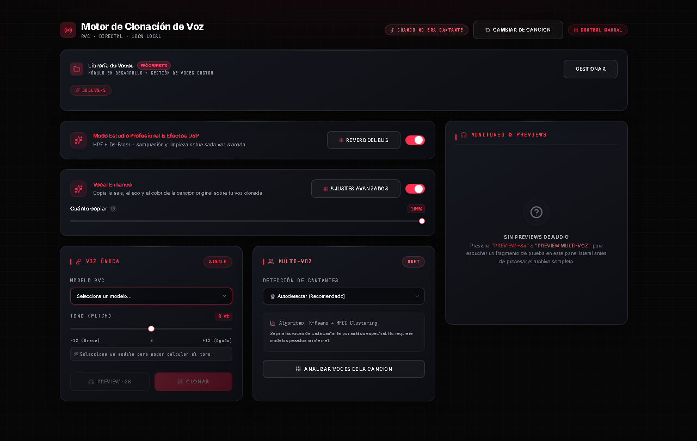
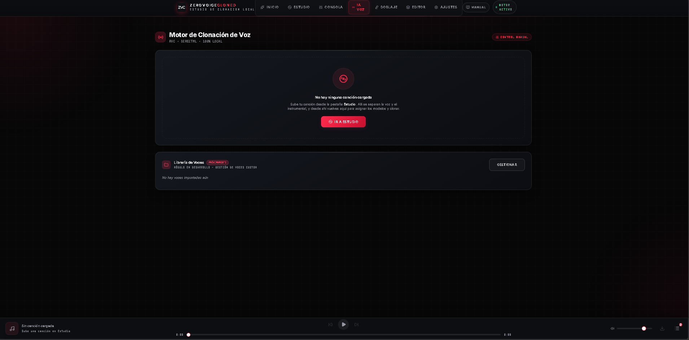

# Qué hace por dentro

Esta es la lista larga: los sistemas que tiene ZeroVoiceCloned y **por qué existe cada
uno**. Casi todos nacieron de un problema concreto que se pudo medir, así que donde hay
números, son medidos.

Si solo quieres saber qué es el programa, el [README](README.md) es más corto.

---

## El recorrido de una canción

Sueltas un archivo —o pegas un enlace, o grabas con el micrófono— y a partir de ahí:

1. **Separación** de voz e instrumental.
2. **Detección** de cuántas personas cantan y en qué tramos.
3. **Clonación** de cada voz con el modelo que elijas.
4. **Adaptación** del resultado a la canción original.
5. **Mezcla, máster y exportación.**

Los pasos 4 y 5 son donde está casi todo lo que sigue, y son los que diferencian «sustituir
una voz» de «que suene como si esa persona hubiera cantado la canción».

---

## Separación y reparto de voces

### Tres modelos de separación
`htdemucs_ft` (máxima calidad), `htdemucs` (más rápido) y `htdemucs_6s`, que además
separa guitarra y piano. Con tres perfiles de velocidad frente a precisión.

### Detección de cantantes sin internet
Agrupación por **K-Means sobre MFCC**: se mide el color espectral de cada tramo y se
agrupan los que pertenecen a la misma persona. No usa modelos pesados ni servicios
externos.

Dos detalles que costaron encontrarse:

- Se agrupa sobre **la voz ya aislada**, no sobre la mezcla. Con el instrumental delante,
  la guitarra y la batería contaminan la medición y aparecen «cantantes» que no existen.
- **No se fuerza el número de grupos hacia arriba.** Al intentar detectar más cantantes de
  los que hay, un mismo intérprete se parte en dos y la canción sale con dos voces
  distintas en el mismo verso.

---

## Multi-voz: duetos, coros y segundas voces

Esta es la parte más difícil del programa, y la que más veces se rehízo.

### Coros y segundas voces separados del cantante principal

Demucs devuelve **una sola pista de voces** con el cantante principal, las armonías, las
voces dobladas y el coro mezclados. Y RVC da por hecho que hay exactamente una voz: HuBERT
ve fonemas superpuestos y el detector de tono salta de un cantante a otro.

Por eso los estribillos con coro salían como un balbuceo, y **ningún parámetro de RVC lo
arreglaba** — no era un problema de ajuste, era un problema de entrada.

La solución es partir la pista antes de clonar, combinando dos pistas independientes y sin
depender de nada externo:

- **Máscara armónica sobre la melodía predominante.** Se busca el tono dominante de cada
  instante y se marca como principal lo que cae sobre ese tono y sus armónicos; lo demás,
  no. Funciona incluso en mono y con armonías centradas en la imagen.
- **Anchura estéreo.** Lo que no está centrado es acompañamiento. Solo se aplica si la
  pista tiene anchura real, para no estropear una grabación mono.

El corte está **deliberadamente sesgado hacia el cantante principal**, y la razón importa:
si se cuela un poco de coro en la voz principal, esa parte simplemente se convierte también
y no pasa nada. Si se cuela voz principal en el coro, el **cantante original queda audible
por debajo del clon** — el efecto de voz doblada que este sistema existe para evitar.

Las dos capas suman exactamente la original, muestra por muestra. El coro se devuelve **sin
tocar**: no se clona, se conserva.

### Duetos dentro del mismo verso

Cuando dos personas cantan **a la vez**, no se elige una: se marca ese tramo como dueto y se
pasan **dos modelos distintos sobre el mismo trozo de audio**, con un desfase de unos
**18 ms** entre ambos. Ese desfase no es un adorno — sin él las dos copias se suman en fase
y aparece filtrado en peine: un sonido metálico, hueco, como cantar dentro de un tubo.

El reparto se marca **por tramo y no por cantante**, que es lo que permite que la misma
persona use un modelo en la estrofa y otro en el estribillo.

Hay un control de **tolerancia de duetos simultáneos** para decidir cuándo dos voces cuentan
como cantando a la vez y cuándo son la misma persona con dos matices.

### Una línea de tiempo exclusiva
Dos cantantes no pueden ocupar el mismo instante por accidente. Cuando eso pasaba, las dos
voces clonadas se pisaban y salía un sonido grave y deformado —«voz de demonio»— que era
imposible de diagnosticar escuchando el resultado: sonaba a fallo del modelo y era un fallo
del reparto.

### La demostración, y por qué esa canción y no otra

**[▶ Ver el sistema multi-voz funcionando](capturas/multivoz-demo.mp4)**

La canción de la demostración no está elegida por bonita: es de las más difíciles que se
le pueden dar a un sistema así, y por eso sirve como prueba.

**Dos voces con registros opuestos.** Un cantante y una cantante, con el tono a mucha
distancia. Eso obliga a que cada voz lleve su propio transporte y su propio modelo, y
convierte cada relevo en un salto de registro entero — no en un cambio de matiz. Si el
reparto se equivoca de tramo, no se disimula: se oye a la primera.

**Y el original va cargado de autotune.** Ese es el segundo problema, y es de los que no se
ven venir: si la voz clonada sale natural encima de una producción con corrección de tono
marcada, suenan a dos grabaciones distintas pegadas. Por eso el programa **mide cuánto
autotune lleva el vocal original** y se lo aplica al clon. Sin eso, el clon puede ser
perfecto y aun así sonar fuera de sitio.

> **Aquí es donde el programa no llegaba, y el vídeo es anterior al arreglo.** Si escuchas
> la demostración con atención se nota que el clon está menos afinado a máquina que la voz
> que sustituye. La causa resultó no ser la cantidad de corrección sino la velocidad: se
> copiaba cuánto se corrige el original y no **cómo de rápido** entra esa corrección, así
> que el clon acababa igual de afinado pero deslizándose hasta cada nota mientras el disco
> saltaba de golpe.
>
> Está arreglado en el registro de cambios, con las dos medidas que faltaban. **El vídeo
> no se ha vuelto a grabar**, así que lo que se oye ahí es el comportamiento anterior; se
> deja porque lo demás que demuestra sigue siendo válido, y porque cambiar la demostración
> sin decirlo sería peor.

**Y las dos voces que se ponen encima son modelos mal entrenados**, de los recuperados.
Los peores de este proyecto se apagaban a **7 276 y 8 376 Hz** —sordos de fábrica— y salen
de la cadena por encima de los **15 900 Hz**, con +43 dB recuperados en la banda del
brillo. Que aguanten en las condiciones de esta canción es justo lo que se quería
demostrar, y no es una diferencia que haya que buscar: se oye a la primera.

> La canción tiene derechos de autor y se usa **como prueba real**, no como producto: una
> mezcla comercial de verdad, con sus coros y sus dos voces, que es lo único que demuestra
> que esto funciona fuera de un caso preparado. No se distribuye la canción ni se reclama
> ningún derecho sobre ella.

### Los relevos entre cantantes, sin costuras

Es la parte que más veces se rompió de todo el programa, y la que más trabajo lleva encima.

Cortar una voz y pegar otra deja marca **siempre**: un clic si el corte cae en mitad de una
onda, un salto de nivel si las dos voces no venían igual de fuertes, una nota desafinada si
el motor arranca en frío, o —lo peor— el cantante original asomando por debajo durante una
décima de segundo. Cada uno de esos fallos hubo que encontrarlo escuchando, entender por
qué pasaba y taparlo por separado.

Un relevo son tres decisiones distintas, y durante mucho tiempo solo estaba resuelta la
tercera:

- **Dónde se corta.** Cuando dos cantantes se solapan en la línea de tiempo hay que partir
  por algún sitio, y se partía por el punto medio exacto. Ese instante cae donde cae, y muy
  a menudo cae dentro de una palabra: la empieza uno y la acaba otro. **No hay fundido que
  arregle eso.** Ahora el corte se mueve al punto de menos energía que haya a 150 ms a la
  redonda —donde el cantante ya está soltando la nota—, sin salirse nunca del tramo
  solapado.

- **Cuánto dura el cruce.** Era un número fijo para toda la canción, y el mismo número no
  puede valer para los dos casos: en una pausa se queda corto y suena a tijeretazo, y a
  mitad de frase se pasa y se oyen literalmente las dos voces a la vez. Ahora cada relevo
  mide lo que suena en su costura y elige: largo en el silencio, corto con la voz sonando.

- **A qué nivel se encuentran.** El cruce reparte bien la potencia —eso ya estaba— pero
  cruza dos grabaciones distintas, y dos clones del mismo verso no salen al mismo volumen.
  Medido sobre una canción real, el peor relevo tenía un escalón de **6 dB**. Ahora los dos
  lados se igualan en el instante del cambio, repartiendo la corrección entre ambos, y se
  desvanece medio segundo después: la estrofa tiene que seguir siendo más floja que el
  estribillo, así que esto cierra un escalón, no nivela dos tramos.

Todo se decide contra el **vocal original**, no contra el clon: el original es quien sabe
dónde acaba una palabra.

Y dos controles más que existen por lo mismo:

- **Fundido de relevo** (30 ms por defecto): ya no fija la duración, pero **escala el rango**
  que se elige solo. Con 30 va de 18 a 140 ms; con el doble, de 36 a 280.
- **Contexto de arranque** (0,5 s): audio real que se le da a RVC **antes** de cada bloque
  para que el detector de tono llegue ya enganchado. Un bloque que empieza en frío empieza
  desafinado.
- **Mezcla de envolvente**: cuánto se conserva la dinámica del original frente a la que
  produce RVC.

---

## Clonación

### Cuatro algoritmos de tono
**RMVPE** (el mejor: cero desafinación en agudos y falsetes), **Crepe** (excelente en canto
muy limpio, más pesado), **Harvest** (precisión media, el tradicional de RVC) y **PM**
(ultrarrápido).

### El contorno de tono, reparado antes de clonar

El motor decide qué nota canta el clon a partir del tono que detecta en el vocal original.
Cuando el detector se equivoca, el modelo canta la nota equivocada — y se equivoca siempre
de las mismas dos maneras:

- **Salta una octava** durante unas décimas de segundo, confundiendo el primer armónico con
  el fundamental. Es lo que se oye como un gallo o un tartamudeo metálico.
- **Se queda mudo a mitad de nota**, sobre todo arriba y en las voces con mucho aire. El
  motor lee ese cero como «aquí no hay voz» y deja de cantar. Es la **causa de raíz** de que
  la voz clonada se apague en los agudos mientras el instrumental sigue.

Los dos defectos se tapaban antes por detrás, sobre el audio ya generado: se le devolvía el
volumen perdido a una nota que el modelo ya había cantado mal. Ahora se arreglan **antes de
que el modelo la cante**. Sobre 25 segundos de una canción real: 5 instantes devueltos a su
octava y 47 recuperados de quedarse mudos.

Lo delicado es no romper a quien sí salta la octava a propósito. La corrección **se propone
mirando el entorno y se confirma mirando el espectro**: se mide la energía armónica real de
las dos hipótesis en ese instante del audio y gana la que de verdad está sonando. Un
cantante que sube la octava en el estribillo sale intacto.

De propina la clonación va **más rápida**, porque el motor ya no tiene que buscar el tono
por su cuenta.

### Consonantes en una pasada aparte

Dos ajustes del motor tiran en direcciones opuestas. El que decide cuánto se respeta la
parte sin tono —las eses, las tes, las pes— y el que decide cuánto manda el índice de
timbre: los valores que dejan las **vocales** sonando a la persona clonada son los que dejan
las **consonantes** blandas o metálicas, y al revés. Con una sola conversión hay que elegir
un punto intermedio que no es bueno para ninguna de las dos.

Activándolo, cada tramo se convierte **dos veces** —una afinada para vocales, otra para
consonantes— y se coge de cada render la parte en la que es mejor, cruzando por un detector
de fricción medido sobre el original.

Se pueden mezclar sin que aparezca filtrado en peine porque no son dos señales distintas:
son la misma conversión con dos ajustes, sobre el mismo audio y el mismo contorno de tono,
así que salen alineadas muestra a muestra. Es justo lo contrario del caso del dueto, donde
las dos voces **sí** necesitan un desfase.

Cuesta literalmente el doble de tiempo, y por eso viene apagado: es para cuando la voz ya
gusta y lo único que falla son las consonantes.

### La letra, y por qué cambia todo lo demás

Todo lo anterior trabaja sobre **energía y tono**: dónde suena fuerte y qué nota es. Nada
de eso sabe qué palabra se está cantando, y varias etapas fallaban justo por ahí.

El programa transcribe la voz una vez por canción y apunta cuándo suena cada palabra. Con
ese dato:

- **Los relevos entre cantantes caen en frontera de palabra.** Antes se buscaba el punto
  más callado alrededor del cambio, y en una nota larga sostenida el punto más callado está
  *dentro* de la palabra: el corte quedaba en el sitio más silencioso y aun así partía la
  sílaba.
- **La pasada de consonantes deja de recorrer la canción entera.** Sabe dónde están: sobre
  una canción real medimos que sólo el **27 %** del tiempo cantado es consonante.
- **El índice se aparta sólo donde borraba la articulación**, en vez de por toda la canción.
- **Sale la letra sincronizada** en `.lrc` para karaoke y `.srt` para el vídeo.

Tarda unos 48 segundos por canción, se hace una sola vez y queda guardada con la sesión.
Corre en su propio entorno dentro del programa, sin conexión y sin instalar nada.

### Una «s» que suena a la persona, no a una vocal

El índice de un modelo es un banco de retazos de esa voz, y en cualquier grabación cantada
las **vocales** ocupan casi todo el tiempo. Así que al buscar el retazo más parecido a una
consonante, lo que encontraba eran vocales: no es que el índice estorbara en las
consonantes, es que ahí no tenía consonantes que ofrecer. De ahí que un clon «masticara» la
letra o se comiera las eses.

Al construir el índice se guarda ahora **de qué tipo de sonido salió cada retazo**, y una
consonante se queda sólo con los que también lo son. Sobre las vocales no se toca nada, y si
un modelo no tiene consonantes suficientes se busca como siempre en vez de devolver algo
lejano por llevar la etiqueta buena.

### Transporte automático al registro del modelo
Un modelo entrenado con una voz grave no puede cantar un tema agudo por mucho que se le
pida: no vio esas notas al entrenarse. El programa mide el registro real del modelo y el de
la canción, y propone el transporte en semitonos que la mete dentro de lo que el modelo
sabe hacer.

### Reconstrucción del índice perdido
Si tienes el `.pth` de un modelo pero perdiste su `.index`, **se puede reconstruir**, y no
hay que reentrenar nada.

El índice no son pesos aprendidos: es un almacén de vectores HuBERT que la inferencia
consulta por vecino más cercano. Se puede recalcular en cualquier momento **a partir de
cualquier grabación de esa persona**.

Y la grabación no tiene que ser cantando: una nota de voz, una llamada o un audio de
WhatsApp sirven. El índice fija **timbre**, no estilo — guarda cómo el tracto vocal de esa
persona colorea el sonido, no qué notas alcanza. Por el mismo motivo da igual que la
grabación suene a teléfono: HuBERT ignora la ecualización de la grabación.

---

## Vocal Enhance y Modo Estudio

Dos interruptores en la pantalla de clonación que encienden, cada uno, una cadena entera.

### Vocal Enhance — «copia la canción original sobre tu voz clonada»

La voz clonada sale limpia y seca, como grabada en una cabina. La canción está en un
espacio, con su eco y su color. Poner una encima de la otra suena exactamente a lo que es:
dos grabaciones distintas pegadas.

Vocal Enhance mide el vocal original y se lo aplica al clon: **la sala, el eco y el color**.
Y no es todo o nada — hay un control de **cuánto copiar**, de 0 a 100 %, porque una canción
muy procesada puede querer menos y una balada seca puede querer todo.

Por debajo son varios de los sistemas de la siguiente sección funcionando juntos: sala,
familia tonal, ataque de frases y autotune.

### Modo Estudio Profesional y efectos DSP

La cadena que se aplica **sobre cada voz clonada por separado**, no sobre la mezcla final:
filtro de graves, de-esser, compresión y limpieza. Es la diferencia entre una voz que se
sienta en la mezcla y una que flota encima.

Aparte va la **reverb del bus**, que se aplica al conjunto y no a cada voz — mandar dos
cantantes a la misma sala es lo que hace que suenen en el mismo sitio.

---

## Lo que hace que suene como la canción, no como un pegote

Aquí está la parte que no se ve en ningún botón y es la que más trabajo lleva detrás. Es
también lo que enciende Vocal Enhance.

### Injerto de banda alta

El problema, medido el 29 de julio de 2026 convirtiendo el mismo fragmento con cuatro
modelos distintos:

| | Banda 8–12 kHz | Techo |
|---|---|---|
| Vocal original (objetivo) | −12,3 dB | 15 972 Hz |
| Modelo A | −37,1 dB | 16 000 Hz |
| Modelo B | −36,9 dB | 15 455 Hz |
| Modelo C | −56,3 dB | 9 000 Hz |
| Modelo D | −69,1 dB | 7 274 Hz |

Esa banda es donde vive el «sonido de micrófono profesional»: el aire, la respiración y la
sibilancia. Sin ella la voz suena apagada y afónica **aunque el volumen sea correcto** — y
lo era, +0,2 dB respecto al original. Por eso ningún fader arreglaba el problema, y por eso
costó tanto entender qué fallaba.

La causa: dos de esos modelos se entrenaron con audio de banda limitada —grabaciones a
16 kHz, notas de voz, llamadas, capturas de Discord— y su decodificador **nunca aprendió a
producir esas frecuencias**. Ningún parámetro de inferencia las puede recuperar.

Y que los modelos de prueba sean así es **a propósito**: el programa se afina contra
modelos entrenados con poco tiempo y material mediocre, que es lo que va a tener la mayoría
de la gente. Con un modelo bueno, todo lo que se hace por el malo suma igual; al revés no
funciona. Está explicado en [Cómo se trabaja en esto](COMO-TRABAJO.md).

Lo que sí se puede hacer es **tomarlas prestadas del vocal original de la canción**, que sí
las tiene. Eso es el injerto: se cruza por encima de los ~7 kHz y se pega el aire del
original sobre el clon. Recupera hasta **+43 dB** en esa banda sin traer nada de la
identidad del cantante original, porque a esas frecuencias ya no hay información de quién
canta, solo textura.

### Copiar la sala del original
La voz clonada sale seca de estudio y la canción está en un espacio concreto. Se mide la
reverberación del vocal original y se aplica sobre el clon, para que no suene pegado encima
de la mezcla.

### Familia tonal
Se copia el **color** del vocal original: dónde tiene el cuerpo, dónde la presencia, cómo
está repartida la energía. Sin esto, dos voces clonadas de canciones distintas suenan
iguales entre sí y distintas a su canción.

### Desreverberación previa
El motor sabe imitar una voz, no una habitación. Con la reverb de la grabación pegada
intenta convertir las dos cosas a la vez, y de ahí salen las colas metálicas y las palabras
borrosas; HuBERT tiene el mismo problema un paso antes, porque lee la cola de la sala como
si fuera parte del sonido de la vocal.

Así que se le da la voz **seca para que la analice**, y la sala se le devuelve después,
medida del original. Lo que se seca es solo lo que el motor analiza, nunca lo que se mezcla:
el resultado no queda más seco, queda más limpio. Sobre una toma que ya venía seca no se
toca nada.

### Ataque de las frases
El clon tiende a suavizar los comienzos de frase. Se le devuelve el ataque del original
para que las entradas no suenen desganadas.

### Detección de autotune

Se mide el tratamiento de tono del vocal original para replicarlo. Una canción con autotune
marcado y un clon perfectamente natural encima suenan a dos producciones distintas pegadas.

Y se miden **tres** cosas, no una, porque con una sola no bastaba:

- **Cuánta** corrección lleva: a cuántos cents de la nota vive la voz.
- **Cómo de rápido** entra: si el tono salta de golpe al empezar cada nota o se desliza
  hasta ella. Es lo que de verdad hace que algo suene a máquina. Dos voces pueden acabar
  igual de pegadas a la nota y sonar completamente distintas según cómo llegan.
- **Hacia qué notas**: apuntar siempre al semitono más cercano de los doce parece lo neutro
  y no lo es. Una nota sesenta cents alta se clava en la de arriba, que a menudo no está en
  la canción — y eso no se oye como robótico, se oye como desafinado. Cuando la canción es
  lo bastante clara como para saber sobre qué notas se mueve, la corrección apunta a ellas.

> Este apartado es el que el manual llevaba tiempo señalando como el más flojo del
> programa. Faltaba la segunda medida: se copiaba la profundidad de la corrección y se le
> dejaban al clon sus propios deslizamientos, así que acababa igual de afinado encima de
> una producción que saltaba de golpe. Sonaban a dos grabaciones por ese detalle.
>
> De las tres, la tercera es la que menos veces se puede aplicar. Sacar la escala de un
> vocal aislado no es fiable en canto natural: sobre una canción real de dos minutos, las
> cuatro notas más usadas se llevan el 65 % y el resto se reparte en trozos del 1 al 6 %
> que igual son melodía e igual son errores del detector. Cuando no está claro, se dice
> que no está claro y se corrige contra las doce notas. Donde sí funciona es en
> producciones muy corregidas — que es justo donde esto importa.

### Dicción y consonantes
Busca **dónde el clon no dice bien lo que dice el original** — consonantes que se comen,
sílabas que se pierden — y lo corrige por tramos, en lugar de aplicar un ajuste global.

### Protección de respiraciones y corrección de formantes
Las respiraciones se mantienen naturales en lugar de convertirse en ruido sintético, y el
tracto vocal se ajusta al cambiar de registro hombre ↔ mujer para que no aparezca el efecto
ardilla.

### Volumen por cantante
Cada voz clonada se nivela por separado contra el original. En una canción con dos
intérpretes, uno puede quedar tapado si se aplica una sola ganancia a todo.

---

## El máster: cómo se cierra la canción

### La voz al centro y la sala abierta

La voz salía idéntica en los dos altavoces contra un instrumental que sí es estéreo, y eso
se oye como una voz pegada al frente, **delante** de la canción en vez de dentro de ella.

Ahora la voz sigue en el centro —que es donde va una voz principal en cualquier disco— y lo
que se abre es la reverberación que la lleva, con dos cadenas de all-pass distintas, una por
canal. Lo que **no** se hace es tomar el canal lateral del vocal original, que sería lo más
directo: ahí dentro está la voz del cantante original, y meterla en los lados sería colar a
la persona equivocada en la mezcla.

### Sonoridad medida, no pico

Lo único que protegía la mezcla final era bajarla si algún pico se pasaba. Eso deja dos
agujeros:

- **El pico no dice nada de lo fuerte que suena algo.** La versión clonada salía más floja
  —o más fuerte— que la canción de la que venía, y había que tocar el volumen al cambiar de
  una a otra.
- **El pico de muestra no es el pico de verdad.** Entre dos muestras la señal reconstruida
  sube más alto que cualquiera de las dos. Un archivo que se queda en 0,96 puede recortar al
  reproducirse: es distorsión que **no está en el WAV y sí en el MP3** que uno descarga.

Ahora se mide la sonoridad integrada según **ITU-R BS.1770-4** —filtro K, bloques de 400 ms,
doble puerta— y el pico real con sobremuestreo x4, y la mezcla se lleva al volumen de la
canción original con un limitador con anticipación que baja **solo alrededor de los picos**
en vez de bajar la canción entera por culpa de un golpe de caja. Sobre una mezcla real: de
−21,3 a −14,8 LUFS y de −1,69 a −1,00 dBTP.

El objetivo es **la propia canción del usuario**, no el número que pide un servicio de
streaming: igualar todo a −14 LUFS cambiaría el carácter de un disco masterizado a −8 a
propósito. Y si llegar hasta ahí obligara al limitador a trabajar más de 6 dB, se sube
menos y se acepta quedarse por debajo — una canción algo más floja se arregla con el mando
del volumen, y una aplastada no se arregla con nada.

### El balance con el instrumental, medido sobre el disco y no sobre los stems

El programa copia la proporción entre voz y fondo que tenía el original. Pero la medía sobre
las dos pistas ya separadas, y esas se guardan igualadas de volumen **cada una por su lado**
—que es lo que hace falta para escucharlas sueltas en el editor y justo lo que destruye la
proporción que se quería copiar—. En una canción con la voz picando a 0,20 y el fondo a
0,90, que es lo normal, la voz acababa cuatro veces por encima de donde el disco la tenía.
Ahora se apunta cuánto se subió cada pista y la cuenta se deshace antes de medir.

---

## Estudio, mezcla y edición

- **Editor multipista**: silenciar tramos, ajustar las regiones donde se aplica cada efecto
  y comparar versiones sin salir de la sesión.
- **Efectos por tramos**: los efectos no son globales; se marcan sobre el mapa de la
  canción.
- **Prueba de 8 segundos** antes de procesar el tema entero. Es lo que evita esperar
  minutos para descubrir que el modelo elegido no era el bueno.
- **Metadatos**: carátula, título y qué modelos se usaron, escritos en el archivo
  exportado.
- **Exportación** en MP3, M4A, FLAC y WAV. Lo que se guarda va en **24 bits** de punta a
  punta: la mezcla de la sesión se relee para aplicarle los efectos del Estudio y se vuelve
  a guardar, así que en 16 bits cada vuelta añadía su propio ruido de redondeo. El FLAC
  —el formato «sin pérdida»— también sale en 24.

---

## Vídeo y doblaje

- **Vídeo 1:1**: entra un vídeo, sale el mismo vídeo con la voz clonada dentro. Sin
  recodificar la imagen.
- **Doblaje**: el vídeo corre sin la voz original y avisa **tres segundos antes** de cada
  intervención, indicando a quién le toca. Grabas leyendo la pantalla.

> **El doblaje no está terminado.** Funciona, pero no acumula todavía pruebas suficientes
> para darlo por bueno en todos los casos. Está marcado como tal dentro del programa.

*Ambas funciones son de la versión completa: no viajan dentro del archivo de prueba.*

---

## Cosas que no se ven pero se notan

- **Aceleración por tarjeta gráfica** con DirectML: AMD, Intel y también NVIDIA, sin
  instalar ni configurar nada.
- **Importación por enlace** de YouTube, o grabación directa con el micrófono.
- **Tiempo restante real**, calculado a partir de lo que va tardando, no una barra que
  avanza inventando.
- **Vigilancia de memoria**: el programa anota cuánta lleva gastada, para que un cierre
  inesperado deje una explicación en vez de un misterio.
- **La sesión sobrevive al navegador**: el motor vive aparte; si cierras la pestaña a mitad
  de un proceso, al volver está todo donde lo dejaste.
- **Todo local**: ni una muestra de audio sale de tu disco. La única conexión que el
  programa abre por su cuenta es la comprobación de versión nueva, y se puede apagar.

---

## Cómo se comprueba todo esto

**385 comprobaciones automáticas** —309 sobre el motor de audio y 76 sobre la interfaz— que
se ejecutan antes de dar por bueno un cambio. La cobertura es más alta justo en las partes
que más veces se rompieron: la cobertura sigue a las cicatrices, no al tamaño del código.

Ninguna medición de las de arriba es una impresión. Cada una salió de comparar números
antes y después, y por eso se pueden escribir aquí con decimales.
